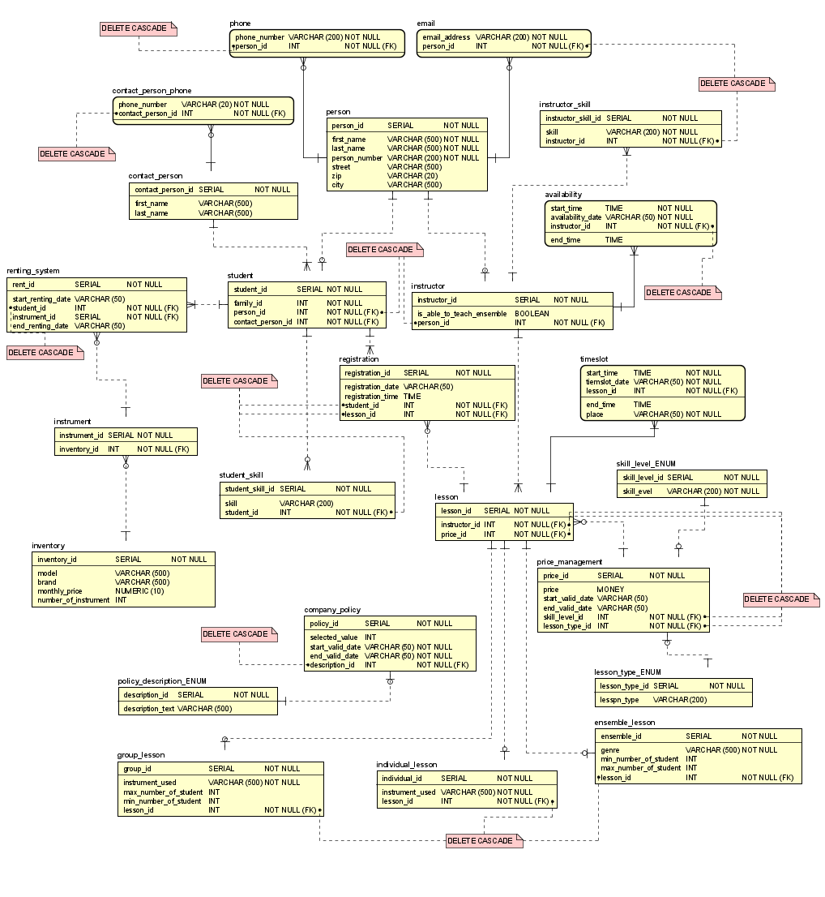

Project Title: SoundGoodMusic Rental System

Description:

This console-based program, developed as the final project for the IV1351 course, allows users to interact with the 
SoundGoodMusic database. The program facilitates the rental, termination, and retrieval of information on available and 
rented musical instruments.

Acknowledgments:

This project uses some utility code from the [jdbc-bank] (https://github/KTH-IV1351/jdbc-bank.git) such as reading
user's input and database connection tools which was provided by the course.

SETUP:
1. Install docker on your machine, you can visit https://www.docker.com/get-started/ for info
2. Make sure you have docker installed by running "docker -v" command in terminal, you should be getting information about client and server
3. Clone the project on your machine or download it as a zip file
4. Navigate to the project directory via terminal "/SoundGoodMusicDB"
5. Run the following commands in terminal to get the application up and running:

   `docker-compose up -d`

   `docker network create sound-good-music-network`

   `docker network connect sound-good-music-network sound-good-music-database`

   `docker network connect sound-good-music-network sound-good-music-application`

   `docker container exec -i -t sound-good-music-application /bin/bash`

   `java -jar SoundGoodMusicDB-1.0-SNAPSHOT.jar`

6. [ALTERNATIVE] Once you are done, you can run the commands below to get rid of the containers 

   `exit`

   `docker-compose down`

Commands and Usages:

    1. LIST_A_I:
        - 'LIST_A_I gui..': 
                list all available Guitar instruments. You can either 
                provide the full name or a substring of that as shown above.
        - No arguments: 
                List all available instruments.

    2.LIST_R_I:
        - 'LIST_R_I 311':
                Lists all rental records for the student with ID 311.
        - No arguments:
                List all rental records.

    3.RENT:
        - 'RENT 1 311':
                Rent the instrument with ID 1 to the student with ID 311.
    
    4.TERMINATE_RENT:
        - 'TERMINATE_RENT 55':
                Terminate the rental record with ID 55.

    5.HELP:
        - Displays information about available commands.

    6.QUIT:
        - Exist the program.

    7.ILLEGAL_COMMAND:
        - Inform the user about an illegal or unrecognized command.

    How to Run:
        First make sure to create the databse using the CreationQueries.sql 
        found in resources. Then populate the database with the generated 
        data found in data-MASTER.sql. Then provide the information needed 
        to connect to your local database in 
        integration/SoundGoodMusicDAO.java. Once you have done the above 
        procedure, compile and run the program as you would normally do with
        a java program.

    Note: 
        This program has been built by MAVEN and includes a dependency 
        "postgresql", make sure it is configured properly.
        
Developer:
    Daniel Ibrahimi

Course:
    IV1351 - Data Storage, KTH - Stockholm

Date:
    29-12/23
